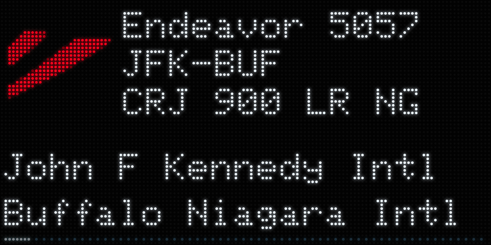
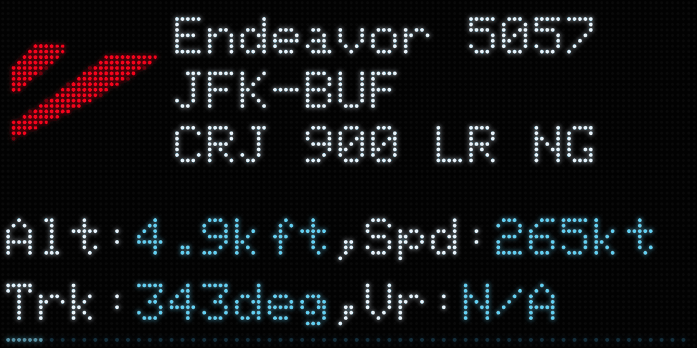
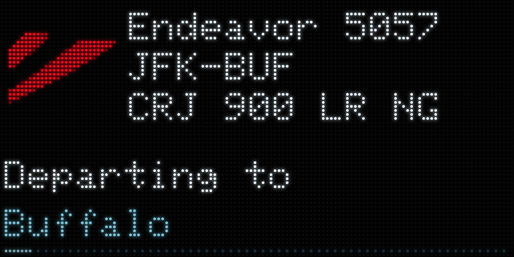
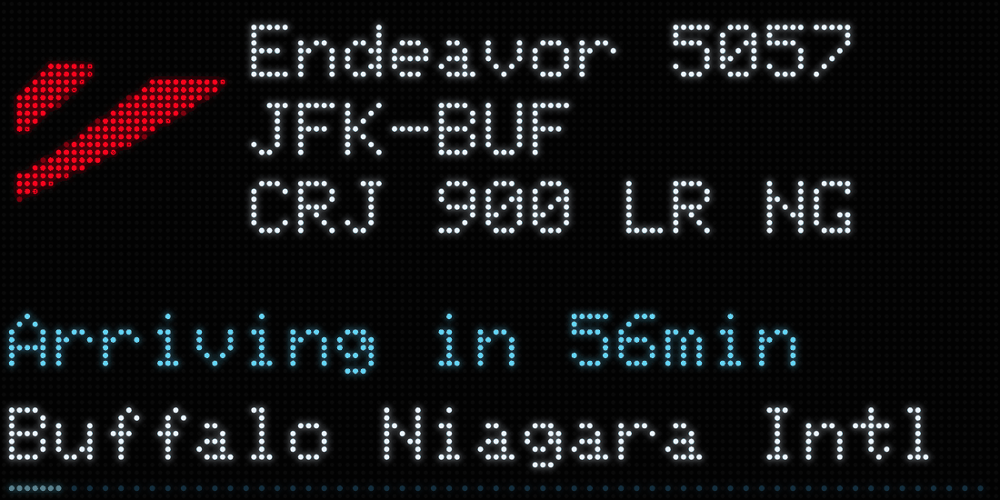
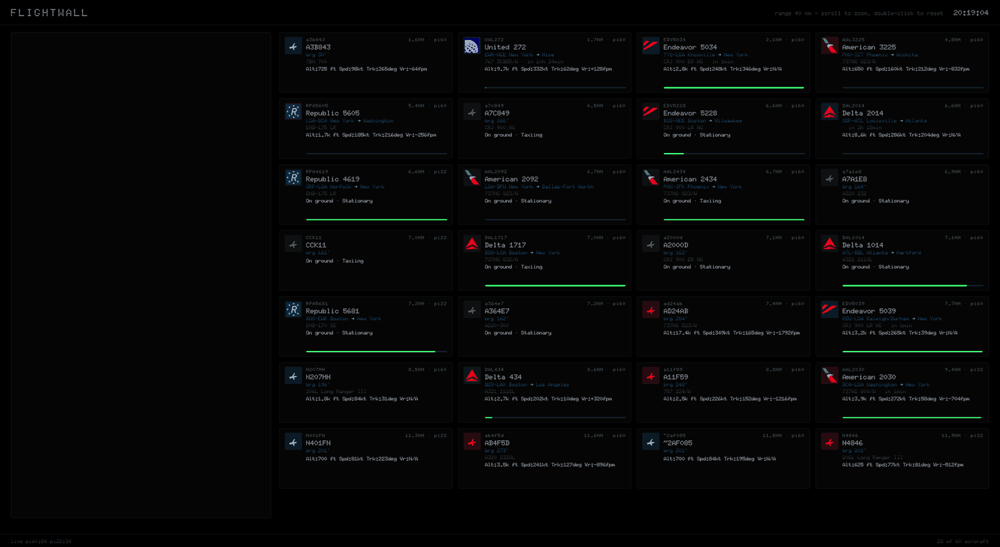
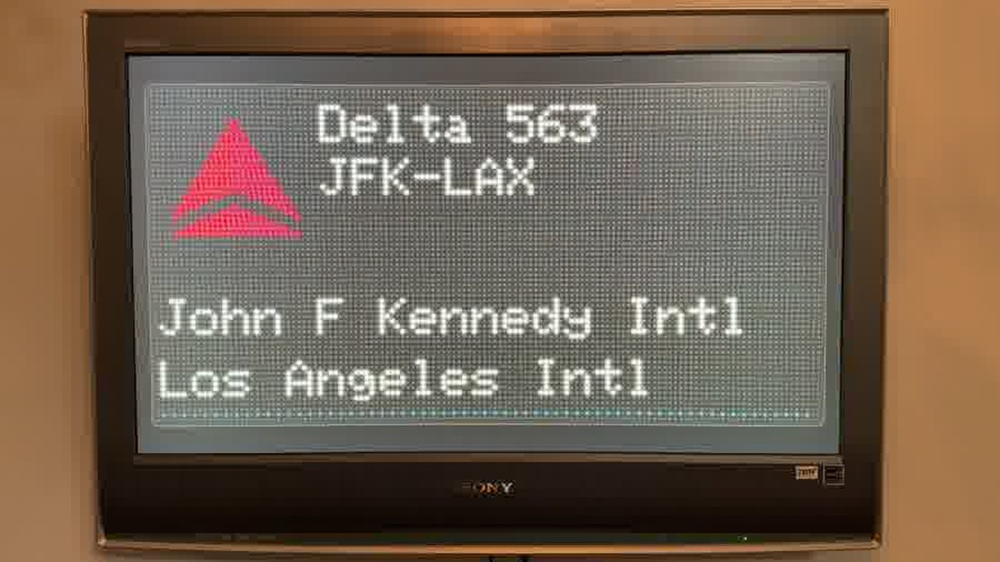

<p align="center">
  
</p>

<div align="center">

# ✈️ FlightBoard

**A dot-matrix LED flight board for your TV, driven by your own ADS-B receiver.**

</div>

FlightBoard turns any browser — and any TV with a Chromecast or a spare Raspberry
Pi — into a live aviation display showing the aircraft overhead right now:
airline, flight number, route, aircraft type, altitude, speed, track and vertical
rate, one flight at a time.

It reads **your own receiver**. If you already run PiAware, dump1090-fa, readsb
or tar1090, you have everything you need. No cloud flight API, no subscription,
no per-query billing, no account.

It isn't styled to *look* like an LED panel — it emulates one. There's a real
framebuffer, text is drawn from the same Adafruit GFX bitmap font the hardware
uses, and every dot you see is an individually addressed LED.

---

- [✈️ FlightBoard](#️-flightboard)
  * [What it looks like](#what-it-looks-like)
  * [Requirements](#requirements)
    + [You need a working ADS-B feeder first](#you-need-a-working-ads-b-feeder-first)
    + [Everything else](#everything-else)
  * [Install](#install)
    + [1. Clone it](#1-clone-it)
    + [2. Create the Python environment](#2-create-the-python-environment)
    + [3. Point it at your receiver and your location](#3-point-it-at-your-receiver-and-your-location)
    + [4. Try it](#4-try-it)
    + [5. Run it at boot](#5-run-it-at-boot)
  * [Airline logos (optional)](#airline-logos-optional)
  * [Better routes (optional)](#better-routes-optional)
  * [Getting it onto a TV](#getting-it-onto-a-tv)
    + [Option A — Chromecast](#option-a--chromecast)
    + [Option B — Raspberry Pi on HDMI](#option-b--raspberry-pi-on-hdmi)
    + [Option C — just a browser](#option-c--just-a-browser)
  * [Keeping it up to date](#keeping-it-up-to-date)
  * [Hiding traffic you don't want](#hiding-traffic-you-dont-want)
  * [Configuration reference](#configuration-reference)
  * [How it works](#how-it-works)
  * [Troubleshooting](#troubleshooting)
  * [Acknowledgements](#acknowledgements)
  * [License](#license)

---

## What it looks like

The panel shows one aircraft at a time. The top three lines hold steady while the
bottom two rotate through whatever that flight can tell you.

| | |
|---|---|
|  |  |
| **Live ADS-B metrics** | **Both ends of the route** |
|  |  |
| **Arriving from / departing to**, when one end is your local airport | **Estimated arrival**, with a progress bar |

There's a second view at `/dashboard` for when you have a big screen and want
everything at once — a zoomable radar plus a tile per aircraft, as many as fit
the window:



And a third at `/?model=oss` that reproduces the 160×32 geometry of the
[TheFlightWall_OSS](https://github.com/AxisNimble/TheFlightWall_OSS) DIY build:


Running on an otherwise-dead TV, cast from a Chromecast:



---

## Requirements

### You need a working ADS-B feeder first

> **This project does not set up an ADS-B receiver, and does not cover it.** It
> assumes you already have one running and serving its JSON feed on your network.

If you're not there yet, start with FlightAware's PiAware guide (or the
ADSBexchange / readsb equivalents), get your receiver decoding and showing
aircraft on its own map, and come back. You'll know you're ready when a URL like
this returns JSON full of aircraft, in a browser or with `curl`:

```
http://YOUR-PI.local/skyaware/data/aircraft.json
```

| Receiver software | Path |
|---|---|
| PiAware / dump1090-fa | `/skyaware/data/aircraft.json` |
| tar1090 | `/tar1090/data/aircraft.json` |
| readsb / dump1090 | `/data/aircraft.json` |

Any of these work. If your receiver produces the standard `aircraft.json`, so
does FlightBoard.

### Everything else

- A machine that stays on, running Linux, with Python **3.9+**. A Raspberry Pi 3
  or better is plenty — including the same Pi that's already running your
  receiver.
- **About 150 MB of free disk.** The install is ~50 MB of Python packages, and
  you want headroom. Check with `df -h /` before you start — a Pi that's been
  feeding for months is often fuller than you'd think. If you're short, the
  usual culprits are logs:
  ```bash
  sudo journalctl --vacuum-size=50M     # systemd journal
  sudo du -xh --max-depth=1 /var/log | sort -rh | head
  ```
  Feeder daemons can be spectacularly chatty — on the Pi this was tested on,
  `fr24feed` had quietly written 1.6 GB of logs with no rotation.
- A display: a Chromecast, a Pi wired to a TV, or just a browser tab.
- Internet access is **optional**. Without it you lose airline names, routes and
  aircraft types. Altitude, speed, track, position and distance all still work.

---

## Install

### 1. Clone it

```bash
git clone https://github.com/gonzalu/FlightBoard.git ~/flightboard
cd ~/flightboard
```

### 2. Create the Python environment

```bash
python3 -m venv .venv
.venv/bin/pip install -r backend/requirements.txt
```

> **If `python3 -m venv` fails** with *"ensurepip is not available"*, install the
> venv package first. The name varies by distro:
> - Raspberry Pi OS / Debian: `sudo apt install python3-venv`
> - Ubuntu: `sudo apt install python3-venv`, or a versioned name such as
>   `sudo apt install python3.12-venv` if apt tells you to

### 3. Point it at your receiver and your location

Two things must be right or you'll get an empty board: the **receiver URL** and
**your coordinates**. Everything is filtered by distance from where you are, so
if the location is wrong, nothing is ever "nearby".

```bash
cp flightboard.env.example flightboard.env
nano flightboard.env
```

How far out to look isn't here: that's `range_nm` in `filters.json`, covered in
[Hiding traffic you don't want](#hiding-traffic-you-dont-want).

The three lines that matter, with the author's own as a worked example:

```
FLIGHTBOARD_HOME_LAT=40.8834
FLIGHTBOARD_HOME_LON=-73.9103
FLIGHTBOARD_RECEIVERS=http://YOUR-PI.local/skyaware/data/aircraft.json
```

Approximate coordinates are fine — three or four decimals off any map. They only
centre the radar and set the range filter, and they stay on your machine:
`flightboard.env` is gitignored because it holds your location.

Set it once. That same file is read both by a manual run and by the systemd
service in step 5, so there is never a second copy of your settings to keep in
step. Anything already in the environment beats the file, which is what makes a
one-off easy without editing anything:

```bash
FLIGHTBOARD_MAX_AIRCRAFT=200 .venv/bin/uvicorn backend.main:app
```

**More than one receiver?** List them comma separated. They're all polled and
merged, deduplicated by aircraft, so a second receiver both widens coverage and
keeps the board alive when the first drops off:

```
FLIGHTBOARD_RECEIVERS=http://pi-roof.local/skyaware/data/aircraft.json,http://pi-desk.local/skyaware/data/aircraft.json
```

### 4. Try it

```bash
.venv/bin/uvicorn backend.main:app --host 0.0.0.0 --port 8090
```

Open `http://YOUR-SERVER:8090/` in a browser. Give it a few seconds — airline and
route lookups fill in progressively after the first aircraft appear.

| URL | View |
|---|---|
| `/` | the LED panel (128×64) |
| `/?model=oss` | the DIY 160×32 build's geometry |
| `/dashboard` | multi-aircraft radar and tiles |
| `/logos.html` | every generated airline logo, searchable |
| `/api/aircraft` | raw JSON, useful for debugging |

### 5. Run it at boot

```bash
sudo cp flightboard-backend.service /etc/systemd/system/
sudoedit /etc/systemd/system/flightboard-backend.service   # fill in the CHANGEME lines
sudo systemctl daemon-reload
sudo systemctl enable --now flightboard-backend
systemctl status flightboard-backend
```

The unit file has an `EDIT THESE` block, and it is only the account name and
two paths — your coordinates and receivers stay in `flightboard.env`, which the
unit reads with `EnvironmentFile=`. See
[Keeping it up to date](#keeping-it-up-to-date) for what a later change needs,
and what it doesn't.

---

## Airline logos (optional)

Out of the box, carriers are drawn as a swept tail fin in their brand colours.
For real airline logos, generate them from artwork you supply:

```bash
sudo apt install -y python3-pil        # Debian's prebuilt Pillow
mkdir -p /tmp/logosrc && cd /tmp/logosrc
curl -sL https://codeload.github.com/Jxck-S/airline-logos/tar.gz/refs/heads/main | tar -xz
cd ~/flightboard
python3 tools/make_logos.py \
    /tmp/logosrc/airline-logos-main/flightaware_logos \
    /tmp/logosrc/airline-logos-main/radarbox_logos \
    /tmp/logosrc/airline-logos-main/radarbox_banners \
    --size 28 --out frontend/logos.js
rm -rf /tmp/logosrc                    # ~150 MB of source artwork, no longer needed
```

Two deliberate details there. It uses **`python3`, not the venv** — `make_logos.py`
imports nothing but PIL, so it has no business needing the app's environment. And
it installs Pillow **via apt rather than pip**, because current Pillow has no
armv7l wheel: on a Raspberry Pi, `pip install Pillow` tries to compile from source
and fails unless you also install `libjpeg-dev` and `zlib1g-dev`. Debian's package
is prebuilt and works immediately.

Generating all ~1,650 logos takes about a minute, even on a Pi 3. Expect a line
reporting some carriers had no usable artwork — that's normal, they fall back to
tail fins. Add `--verbose` to see which.

Reload the page and airlines appear with their own marks. Files are matched by
**ICAO code** (`DAL.png`, `AAL.png`) because that's the prefix FlightBoard reads
off the callsign. Later directories act as fallbacks, used only when earlier
artwork can't survive being reduced to a 28 px square.

A handful of carriers aren't served well by that archive: their entry is a long
wordmark that turns to mush at 28 px, while a good compact mark exists elsewhere.
`tools/fetch_logo_art.py` pulls those specific files — currently NetJets' app
icon and Flexjet's original vector, both of which are then cropped to the part
that reads. It's a short hand-checked list, not a crawler. Run it before
generating and put its directory first:

```bash
python3 tools/fetch_logo_art.py
python3 tools/make_logos.py logo-sources/custom logo-sources/fetched \
    /tmp/logosrc/airline-logos-main/flightaware_logos \
    /tmp/logosrc/airline-logos-main/radarbox_logos \
    /tmp/logosrc/airline-logos-main/radarbox_banners \
    --size 28 --out frontend/logos.js
```

Skip it and those carriers just fall back to the archive, same as before.

**A clean clone will not reproduce every mark, and the generator says which.**
`logo-sources/` is gitignored, because it holds trademarked artwork, so anything
hand-supplied stays on the machine it was made on. Where a better source exists
in the archive it is named in `PREFER_SOURCE` instead of being copied, which
does travel. What is left needs a local file:

| carrier | what it needs |
|---|---|
| NYPD | their header logo saved from nyc.gov, which answers a plain client with 403 |
| VJA | Vista America's banner from the archive's `avcodes_banners`, a directory this project does not pass |
| GPD | Tradewind's mark redrawn by hand at 28×28, since no reduction of it works |

Run the generator and it reports any table entry it could not satisfy, so a
board that differs from its source says so rather than quietly drifting.

A few knobs at the top of `tools/make_logos.py`, all one-line entries:

| | |
|---|---|
| `BACKGROUND` | force a carrier onto black or onto a light tile |
| `CROPS` | use a square region of a wider logo |
| `KNOCK_COLOURED_BG` | strip a solid colour background |
| `LIGHT_INK_VALUE` / `LIGHT_INK_SAT` | where the automatic light/dark decision sits |

Almost every carrier ends up knocked out on black, which is what an LED sign
looks like. A light tile — every LED lit, the mark composited on top — is the
exception, reserved for ink that is both dim and washed out, like a plain black
wordmark. Colour is not the same as brightness here: a saturated navy or a deep
red looks dark but reads beautifully once its brightness is lifted, so the
decision is made on the ink's HSV *value*, not its luminance.

`frontend/logo-aliases.js` maps a callsign prefix to another carrier's logo,
which is how regional airlines get their mainline partner's tail.

**Operators that aren't airlines** are handled in the same file. Police, air
ambulance, tour and survey aircraft fly under a bare registration, so there's no
callsign prefix to key a logo off. Two things cover them. Where the operator has
a real ICAO code, hexdb reports it and the normal lookup takes over by itself —
that's how a NetJets bizjet flying as `N741QS` gets the NetJets mark. Where it
has no code at all, map part of the registered owner's name in `OPERATOR_LOGOS`
and supply the artwork:

```js
const OPERATOR_LOGOS = {
  'NEW YORK CITY POLICE': 'NYPD',
};
```

Then drop `NYPD.png` into a source directory and put that directory first when
generating:

```bash
python3 tools/make_logos.py logo-sources/custom logo-sources/fetched     /tmp/logosrc/airline-logos-main/flightaware_logos ...
```

The name is matched as an uppercase substring of the owner, so a partial name is
enough, and the longest matching entry wins. Keep entries specific: `POLICE`
alone would put one badge on every force in the country.

Some carriers' marks are just their name, and a seven-letter wordmark reduced to
a 28 px tile gets about four pixels a letter and runs together. No amount of
source resolution fixes that. `frontend/wordmarks.js` draws those as type
instead, which stays sharp and is what an LED sign would really do; jetBlue
ships as the worked example. Reach for it only when the carrier genuinely has no
compact symbol anywhere, since the panel already prints the airline's name in
the line beside the tile and a wordmark says it twice. An entry is only the text, since the colour comes
from `AIRLINE_COLORS` in `panel.js`, and a listed wordmark is preferred to
generated artwork.

It carries its own **narrow proportional face**, 2 to 4 columns a glyph, because
the panel's `glcdfont` is fixed at 6 columns: "jetBlue" would want 42 columns and
has 28. Proportionally it fits on one line with a column spare. The face holds
only the letters the entries actually use, and a wordmark naming a letter that
hasn't been drawn falls back to artwork rather than rendering a gap, so adding a
carrier means adding its missing glyphs. They're written as pictures, so that is
done by eye.

**Open `/logos.html` to see what you actually got.** It renders every mark
exactly as the panel draws it, wordmarks included, filterable by ICAO code and
by background treatment. Far easier than waiting for a carrier to fly overhead to find out
whether its mark survived the reduction — and it's how you decide which entries
the tables above need.

> ⚠️ **Airline logos are trademarks of their airlines.** `frontend/logos.js` is
> generated locally and is **gitignored on purpose** — please don't commit
> artwork into a public fork. Generating it for your own display is one thing;
> redistributing it is another.

---

## Better routes (optional)

Out of the box, routes come from [adsbdb](https://www.adsbdb.com/) and
[hexdb.io](https://hexdb.io/). Both are free and keyless, and both are static
callsign-to-route mappings with no notion of today. Airlines reuse flight
numbers, so a fair number of them are simply for a different flight: measured
against live traffic here, between one in seven and one in three were wrong.

Virtual Radar Server publishes a community-curated version of the same thing,
corrected continuously by the people running receivers. Checked against
FlightAware on four flights the free API got all four wrong and this got three
right. It also knows aircraft the APIs have never heard of.

```bash
python3 tools/fetch_standing_data.py
```

That builds `data/standing-data.sqlite`, about 30 MB in a couple of seconds,
holding 620,000 routes, 34,000 airports, 5,900 airlines, 17,000 airframes and
the ICAO address blocks that say which country an aircraft is registered in.
Every lookup is then local: **no network call, no rate limit, no key**, and the
board keeps naming flights when the internet is down and your receivers are
not. It is SQLite rather than a table in memory so that a Pi 3 can hold it.

The data is CC0. Re-run the tool whenever you like; the upstream mirror
refreshes hourly, though routes change slowly enough that weekly is plenty.

**If the board shows a route you know is wrong**, fix it for everybody at
[the SDM site](https://sdm.virtualradarserver.co.uk/Edit). That is what makes
this database better than the alternatives, and it only stays that way because
people correct it.

Sources are tried local first, then adsbdb, then hexdb, and whatever comes back
still has to pass the plausibility check described in *How it works* - none of
them know what day it is.

---

## Getting it onto a TV

### Option A — Chromecast

The stick loads the page and renders it itself, so no computer has to stay awake
driving the picture.

```bash
.venv/bin/pip install catt
.venv/bin/catt scan
.venv/bin/catt -d "Living Room TV" cast_site "http://YOUR-SERVER:8090/"
```

To have it re-establish itself after a reboot or power blip:

```bash
sudo cp flightboard-cast.service flightboard-cast.timer /etc/systemd/system/
sudoedit /etc/systemd/system/flightboard-cast.service   # user, device name, URL
sudo systemctl daemon-reload
sudo systemctl enable --now flightboard-cast.timer
```

The watchdog checks every five minutes and only re-casts an **idle** Chromecast —
if you're watching something else on that TV, it leaves you alone.

> `cast_site` relies on the DashCast receiver, which isn't a documented Google
> feature. It works on classic Chromecast sticks and Chromecast Ultra. It does
> **not** work on Chromecast with Google TV. If it ever stops working, Option B
> is the durable answer.

### Option B — Raspberry Pi on HDMI

The most robust option, and it needs no casting protocol at all. Any spare Pi,
Raspberry Pi OS Lite, and Chromium in kiosk mode:

```bash
sudo apt install chromium-browser cage
cage -- chromium-browser --kiosk --noerrdialogs --disable-infobars \
     --check-for-update-interval=31536000 http://YOUR-SERVER:8090/
```

Add that as a systemd service to start at boot. `cec-utils` can also switch the
TV on and off on a schedule over HDMI-CEC, which makes it feel built in.

### Option C — just a browser

Open the URL and press F11. Perfectly good on a spare monitor.

---

## Keeping it up to date

Most of the time this is the whole thing, and the restart is harmless when it
wasn't needed:

```bash
cd ~/flightboard && git pull && sudo systemctl restart flightboard-backend
```

What actually needs what:

| Changed | What's needed |
|---|---|
| anything in `frontend/` | nothing at all — see *Displays update themselves* below |
| anything in `backend/` | `sudo systemctl restart flightboard-backend` |
| `flightboard.env` | a restart; settings are read once, at startup |
| `flightboard-backend.service` | `sudo systemctl daemon-reload`, then a restart |
| `tools/make_logos.py`, `tools/fetch_logo_art.py` | regenerate the logos — see below |
| `tools/fetch_standing_data.py` | rebuild the local database: `python3 tools/fetch_standing_data.py` |

**`frontend/logos.js` does not arrive with a `git pull`.** It is generated from
artwork you fetch locally and is gitignored, so when the generator changes your
existing copy stays exactly as it was and the new marks never appear. That is
the one update that isn't automatic:

```bash
cd ~/flightboard
python3 tools/fetch_logo_art.py
mkdir -p /tmp/logosrc && cd /tmp/logosrc
curl -sL https://codeload.github.com/Jxck-S/airline-logos/tar.gz/refs/heads/main | tar -xz
cd ~/flightboard
python3 tools/make_logos.py logo-sources/custom logo-sources/fetched \
    /tmp/logosrc/airline-logos-main/flightaware_logos \
    /tmp/logosrc/airline-logos-main/radarbox_logos \
    /tmp/logosrc/airline-logos-main/radarbox_banners \
    --size 28 --out frontend/logos.js
rm -rf /tmp/logosrc                    # ~150 MB of source artwork, no longer needed
```

Check the free space first if this is a long-running feeder Pi. No restart
afterwards: `logos.js` is a frontend file like any other.

**Displays update themselves.** A cast page loads its URL once and would
otherwise render the same build for months, so `/api/aircraft` carries a
fingerprint of the whole `frontend/` directory and the panel reloads when it
changes. New files count as well as changed ones, so a Chromecast picks up a
release that adds a script without being re-cast. The fingerprint is computed
per request, which is why a frontend change needs no restart.

**The standing-data database is not in the repository either**, for the same
reason as the logos: it is generated and large. A clone has the tool but no
database, and falls back to the online lookups until you run it:

```bash
python3 tools/fetch_standing_data.py
```

To watch the backend the way you would a foreground `uvicorn`:

```bash
journalctl -u flightboard-backend -f
```

---

## Hiding traffic you don't want

Busy airspace puts a lot on the board that you may not care about. Copy the
example and edit your own copy, which is gitignored:

```bash
cp filters.example.json filters.json
```

```json
{
  "exclude": {
    "hex": ["a1b2c3"],
    "airlines": ["SWA", "FDX"],
    "registrations": ["N123AB"],
    "types": ["CRJ"],
    "airports": ["LGA"]
  },
  "range_nm": 40,
  "altitude_ft": { "min": 3000, "max": null }
}
```

Every section is optional and an empty list hides nothing. **Range lives here
too**, rather than in `flightboard.env`, because it answers the same question as
the altitude band and it is the setting you actually adjust while watching, so
it belongs in the file that re-reads itself.

| Section | Matches |
|---|---|
| `hex` | ICAO 24-bit address, exactly |
| `airlines` | the ICAO prefix of the callsign, so `SWA` catches `SWA3010` |
| `registrations` | tail number, exactly |
| `types` | **substring**, so `CRJ` catches `CRJ 900`, `CRJ-900` and `CRJ 900 LR NG` alike |
| `airports` | IATA code at *either* end of the route |
| `altitude_ft` | `min` and `max` in feet; `null` for no limit |
| `range_nm` | how far out to look, in nautical miles (default `40`) |

Check an edit before wondering why nothing happened. JSON is unforgiving and
every value has to be a quoted string, so `["LGA"]` and never `[LGA]`:

```bash
python3 -m backend.filters
```

It prints what is being hidden, or the exact line of the problem and a non-zero
exit code.

**It is re-read whenever the file changes**, so edit it and the board catches up
within a poll. Nothing to restart. Save a syntax error and the last rules that
parsed stay in force, with a note in the log, rather than every filter vanishing
because of a stray comma.

Two things worth knowing. Aircraft on the ground report as 0 feet, so a `min` of
`1` drops them, and an aircraft reporting no altitude at all is kept rather than
hidden, since missing data shouldn't act like a filter you didn't ask for. And
`hex`, `airlines` and `altitude_ft` match what the aircraft broadcasts, so they
cost nothing, while `registrations`, `types` and `airports` need a lookup first
and may let an aircraft show for a moment before it disappears.

The startup log says what is being hidden, which is the first place to look when
something you expected doesn't appear.

---

## Configuration reference

All settings are read at startup from, in order: the environment, then
`flightboard.env` beside the checkout, then the defaults below. Put yours in the
file and use the environment to override one for a single run. Which aircraft
you *hide* is separate, and lives in `filters.json` — see
[Hiding traffic you don't want](#hiding-traffic-you-dont-want).

| Variable | Default | What it does |
|---|---|---|
| `FLIGHTBOARD_RECEIVERS` | *(see below)* | Comma-separated receiver JSON URLs. All are polled and merged. |
| `FLIGHTBOARD_HOME_LAT` | `0.0` | Your latitude. **Set this.** |
| `FLIGHTBOARD_HOME_LON` | `0.0` | Your longitude. **Set this.** |
| *(range moved)* | | How far out to look is `range_nm` in `filters.json`, not a variable here. |
| `FLIGHTBOARD_LOCAL_AIRPORT_NM` | `30` | An airport this close counts as "local", which turns a route into *Arriving from…* / *Departing to…* |
| `FLIGHTBOARD_MAX_AIRCRAFT` | `60` | Cap on how many aircraft the API returns. |
| `FLIGHTBOARD_POLL_INTERVAL` | `2` | Seconds between receiver polls. |
| `FLIGHTBOARD_ENABLE_ENRICH` | `1` | Set `0` to disable adsbdb and hexdb lookups and run fully offline. |
| `FLIGHTBOARD_ENRICH_TTL` | `3600` | Seconds to cache an airline/route/type lookup. |
| `FLIGHTBOARD_PORT` | `8090` | Port. |

Display behaviour lives in `CFG` at the top of `frontend/panel.js`: `PAGE_MS`
(how long each bottom page holds), `MAX_FLIGHTS` (how many aircraft to cycle
through), `SKIP_GROUND` (whether to include aircraft on the ground).

---

## How it works

```
your receiver(s) ──aircraft.json──> FlightBoard backend ──/api/aircraft──> panel / dashboard
                                           │
                                           ├── standing-data.sqlite  (local: routes, no network)
                                           ├── adsbdb.com  (optional: airline, route, type)
                                           └── hexdb.io    (optional: owner, and the gaps)
```

The **backend** polls every receiver every couple of seconds, merges the aircraft
(freshest position wins on duplicates), works out distance and bearing from your
location, and serves both the API and the frontend from one origin.

Airline, route and aircraft type come from [adsbdb](https://www.adsbdb.com/),
with [hexdb.io](https://hexdb.io/) behind it. Both are free and keyless. Those
lookups run in a **background worker**, never inside the poll loop, so a burst
of unknown aircraft can't stall the position feed. Results are cached, including
negative ones, and served stale while they refresh.

Routes and airframes are looked up locally first, in the Virtual Radar Server
standing data if you have built it, and only then online. The two are treated
differently: a route the local database knows is taken as final, while an
airframe is merged with whatever the online sources add, because none of the
three is a superset of the others. The local copy is the only one that knew a
JetBlue A220 and an American A321XLR delivered this year; adsbdb was the only
one that knew a 1998 Delta 767 that has been flying the whole time. A multi-stop route is resolved to
the leg the aircraft is actually flying by picking the pair of airports it sits
most nearly between, which is how a Seoul-Anchorage-JFK-Brussels cargo run shows
the right half of itself.

The two online sources are combined differently on purpose. A **route** stops at the
first answer, because adsbdb returns full airport records and that is what gives
the board place names, a progress bar and an ETA, while hexdb returns bare
codes. An **aircraft record** is *merged* across both, because adsbdb has the
better type and manufacturer but only hexdb carries the registered owner.

That owner matters more than it sounds. Roughly a quarter of the traffic over a
city is general aviation broadcasting a tail number with no airline at all, and
until it arrives the board has nothing to say about any of them. With it, a
helicopter over the Bronx reads *Operated by / Helicopters Inc* rather than
nothing. The page is skipped for airliners, where it would only repeat the name
already on the line above.

The **panel** is a genuine emulation. `frontend/glcdfont.js` is the Adafruit GFX
classic 5×7 bitmap font — the same table the hardware draws with — blitted one
bit per LED into a framebuffer, which is then drawn as physical dots with the
unlit LEDs still visible between them. At 6 px per character a 128 px panel fits
21 characters, and that constraint is why the readouts are written the way they
are.

---

## Troubleshooting

**The board says "NO LOCATION"**
`FLIGHTBOARD_HOME_LAT` / `_LON` aren't set, so home is `0.0, 0.0` in the
Atlantic and nothing is ever nearby. The backend says the same thing on startup,
along with the receivers it will poll. Note that a receiver reports `ok` here
regardless — it is being read perfectly well, its aircraft are just all being
filtered out by distance.

**The board says "No aircraft in range"**
Your location is set, so this is genuine. Check
`curl http://YOUR-SERVER:8090/api/aircraft`, confirm the coordinates are really
yours and not transposed, and try widening `range_nm` in `filters.json`.

**A filter isn't taking effect**
The file almost certainly didn't parse, in which case the last rules that *did*
parse stay in force and yours are ignored. Run `python3 -m backend.filters` to
see the offending line. `/api/aircraft` also carries a `filters_error` field,
null when the file is good. The commonest mistake is an unquoted value: JSON
needs `["LGA"]`, not `[LGA]`.

**It says "NO FEED"**
The backend can't reach a receiver. Test the URL directly with `curl`. The API's
`sources` field reports each receiver separately, so you can see which one is
down. The board keeps showing the last good data for 90 seconds before giving up,
so brief network blips don't blank the display.

**Airlines and routes are missing, but altitude and speed are fine**
That's both lookup services being unreachable, or the aircraft genuinely being
unknown — GA
aircraft have no airline. Check outbound internet, or set
`FLIGHTBOARD_ENABLE_ENRICH=0` if you meant to run offline.

**`catt scan` finds nothing**
The Chromecast has to be powered on and on the same subnet — discovery is mDNS
and doesn't cross VLANs. Some managed switches and access points block multicast.

**Everything works but the display never changes**
Browsers throttle timers in background tabs. Make it the foreground tab, or use
kiosk mode.

---

## Acknowledgements

- **[TheFlightWall](https://theflightwall.com/)** for the original idea, and
  [TheFlightWall_OSS](https://github.com/AxisNimble/TheFlightWall_OSS) for the
  firmware that documents how the real panel is laid out and drawn. FlightBoard
  is an independent project inspired by it — not affiliated with, endorsed by, or
  a product of TheFlightWall.
- **[Adafruit](https://github.com/adafruit/Adafruit-GFX-Library)** for the GFX
  library, whose classic 5×7 bitmap font (BSD licensed) is embedded here as
  `frontend/glcdfont.js`.
- **[adsbdb](https://www.adsbdb.com/)** for a genuinely free, keyless API for
  airline, route and aircraft lookups.
- **[Virtual Radar Server](https://www.virtualradarserver.co.uk/)** for the
  community-curated [standing data](https://github.com/vradarserver/standing-data)
  of routes, airports and airlines, released CC0, and for the
  [SDM site](https://sdm.virtualradarserver.co.uk/Edit) where anyone can correct
  it. Mirrored hourly by [adsb.lol](https://github.com/adsblol/vrs-standing-data).
  It is better than every alternative here because people fix it.
- **[hexdb.io](https://hexdb.io/)** for the same, free and keyless, and for
  knowing the light aircraft and bizjets nobody else does. Adding it as a second
  source was an idea taken from
  [biohead's fork](https://github.com/biohead/TheFlightWall_OSS) of
  TheFlightWall_OSS.
- **[Jxck-S/airline-logos](https://github.com/Jxck-S/airline-logos)** for
  collecting airline logo artwork by ICAO code.
- **[catt](https://github.com/skorokithakis/catt)** and
  **[pychromecast](https://github.com/home-assistant-libs/pychromecast)** for
  making Chromecasts scriptable.
- Everyone feeding **FlightAware**, **ADSBexchange** and friends — this project is
  only interesting because you already run a receiver.

## License

Apache License 2.0 — see [LICENSE](LICENSE).

The embedded Adafruit GFX font is BSD licensed and remains © Adafruit. Airline
logos processed by `tools/make_logos.py` are trademarks of their respective
airlines and are not distributed with this project.
